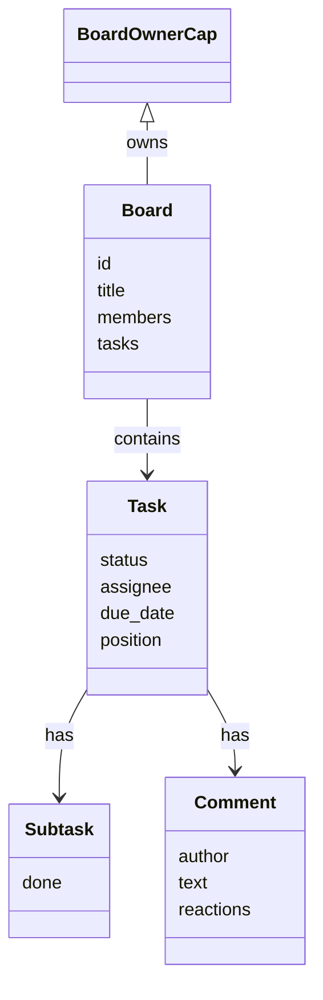

# TOAD — On-Chain Project Management on Sui

[](./LICENSE)
[](https://github.com/ttc915/toad-sui-project-management/stargazers)
[](https://github.com/ttc915/toad-sui-project-management/network)
[](https://github.com/ttc915/toad-sui-project-management/commits/main)
[](https://move-language.github.io/move/)

TOAD is a **decentralized project management platform** on the **Sui blockchain**, delivering immutable task tracking, role-based access, and on-chain ownership for distributed teams.

---

## 🚀 My Contributions (Smart Contracts)

I focused **solely on the Move smart contract design**:

- Designed **Move contracts** for boards, tasks, subtasks, and permissions
- Implemented **task lifecycle logic**: create → assign → update → complete → archive
- Built **role-based access** and ownership capabilities on-chain
- Developed **unit tests** covering permissions, task operations, and subtasks/comments
- Optimized **on-chain storage** with dynamic fields and efficient object structures

> Note: Frontend, AI assistant, and other features were handled by the broader team.

---

## 🧠 Key Features (Platform Overview)

- **On-Chain Boards & Tasks**: Immutable history and ownership
- **Role-Based Permissions**: Owner, Admin, Contributor
- **Subtasks & Comments**: Hierarchical tasks with discussion threads
- **Emoji Reactions**: Quick collaborative feedback
- **Client-Side Encryption**: Optional AES-GCM for sensitive data
- **AI Assistant**: Gemini-powered workflow guidance
- **zkLogin Integration**: Google login via Sui zkLogin
- **Multiple Views**: Kanban, List, Calendar, Timeline, Analytics

---

## 🛠️ Tech Stack

- **Smart Contracts:** Move (Sui 2024) ✅ _my focus_
- **Frontend:** React + TypeScript + Vite
- **Wallets:** @mysten/dapp-kit
- **State Management:** @tanstack/react-query
- **Styling:** Tailwind CSS
- **AI & Auth:** Google Gemini 2.0, zkLogin
- **Encryption:** Client-side AES-GCM

---

## ▶️ Quick Start (Local)

```bash
# Clone repo
git clone https://github.com/ttc915/toad-sui-project-management.git
cd toad-sui-project-management

# Install frontend dependencies
npm install

# Configure environment
cp .env.example .env
```

Set environment variables in `.env`:

- `VITE_TOAD_PACKAGE_ID` → your Move package ID
- `VITE_GEMINI_API_KEY` → optional, for AI assistant
- `VITE_GOOGLE_CLIENT_ID` → optional, for zkLogin

### Deploy Move Contracts (Your Contribution)

```bash
cd move/toad
sui move build
sui client publish --gas-budget 100000000
```

Update `VITE_TOAD_PACKAGE_ID` in `.env` with the published ID.

### Run Development Server (Frontend)

```bash
npm run dev
```

Frontend available at: [http://localhost:5173](http://localhost:5173)

---

## 🧪 Testing (Move Contracts)

```bash
cd move/toad
sui move test
```

Covers:

- Board creation/deletion
- Member management & permissions
- Task CRUD & lifecycle
- Subtasks & comments
- Access control checks

---

## 🔧 Move Contract Structure

- **Board**: Workspace object
- **BoardOwnerCap**: Ownership capability
- **Task**: Individual task
- **Subtask**: Child task
- **Comment**: Discussion threads

#### Entry Functions

- Board: `create_board`, `delete_board`, `add_member`, `update_member_role`
- Task: `create_task`, `update_task_position`, `assign_task`, `set_task_due_date`
- Subtasks/Comments: `create_subtask`, `toggle_subtask_done`, `add_comment`, `add_reaction`

---

## 🌍 Origin

Built during the **Sui Builder Forge Hackathon**, now maintained as a **personal showcase of my smart contract work**.

Original repo: [Romania-Sui-Builders/TOAD](https://github.com/Romania-Sui-Builders/TOAD)

---

## 🏗️ Architecture & Workflow

### Move Objects & Relations



Legend: Frontend signs transactions via Sui wallet; Move modules enforce board/task permissions and emit events consumed by the React UI.

---

## 📄 License

MIT
